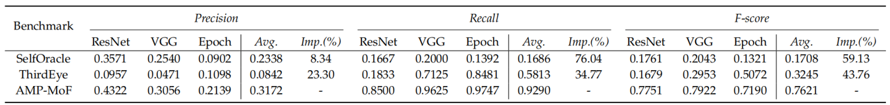

# Misbehavior Prediction of Autonomous Driving System via Motion Features

This project is the implementation of our Paper: [Misbehavior Prediction of Autonomous Driving System via Motion Features], which is submitted to **IEEE Transaction of Software Engineerring.** We proposed a SOTA model for ADS misbehavior Prediciton.



Our model is trained on one 4090 GPU for 300 epochs, which takes about 35 hours.
## Usage
### Installation

```bash
git clone https://github.com/hiber-wang/AMP-MoF.git
cd AMP-MoF 
pip3 install -r requirements.txt
```

### Run

#### 😆Training

```bash
python3 -m torch.distributed.launch --nproc_per_node=8 \
./scripts/train.py \
--train_dataset path_of_train_dataset \
--val_datasets path_of_val_dataset \
--batch_size 8 \
--num_gpu 8
```

#### 😋Testing

```bash
python3 ./scripts/test.py \
--val_datasets path_of_test_dataset \
--load_path path_of_pretrained_weights \
```

## Recommend
We sincerely recommend some related papers:

ICSE20 - [Misbehaviour Prediction for Autonomous Driving Systems](https://github.com/testingautomated-usi/selforacle)

ASE22 - [ThirdEye: Attention Maps for Safe Autonomous Driving Systems](https://github.com/tsigalko18/ase22)
