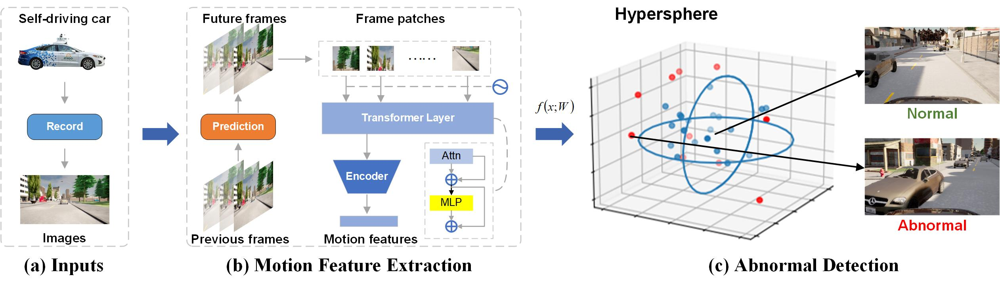
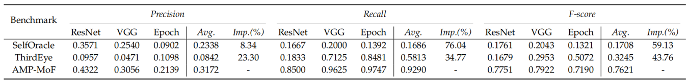

# Misbehavior Prediction of Autonomous Driving System via Motion Features

This project is the implementation of our Paper: "Misbehavior Prediction of Autonomous Driving System via Motion Features",  we proposed a SOTA model for ADS misbehavior Prediciton.

In recent years, it has become a hot topic in software engineering to predict Autonomous Driving System (ADS) misbehaviors. Although some methods (e.g., SelfOracle and ThirdEye) have been proposed to automatically predict ADS misbehaviors to avoid fatal accidents, there remains two challenges, namely motion information acquisition and misbehavior measurement. In this study, we propose AMP-MoF, a novel method to effectively predict the misbehavior of ADS via motion features. Specifically, we focus specifically on predicting two types of misbehavior in autonomous driving: collisions and lane departures. First, AMP-MoF collects images from the front camera of an autonomous vehicle as input and timely extracts dynamic motion features from the image sequence. Then, a transformer based technique is proposed in AMP-MoF to project the extracted features into a hypersphere space, which reflects the potential distribution of normal behavior features, thus addressing the motion information acquisition. Finally, AMP-MoF leverages a method based on the Gamma distribution to identify the behaviors with features projected outside the hypersphere as the misbehaviors, thus addressing the misbehavior measurement challenge. We evaluate the effectiveness of AMP-MoF in predicting the misbehavior caused by abnormal traffic situations (i.e., bad weather and heavy traffic). Experimental results show that AMP-MoF can accurately predict ADS misbehaviors, with an average _Precision_ value of 0.3172, and an average _Recall_ value of 0.9290. AMP-MoF achieves an average _F-score_ value of 0.7621, significantly outperforming the state-of-the-art methods by 43.76%~59.13%.



## Result


Our model is trained on one 4080 GPU for 200 epochs, which takes about 35 hours.
## Usage
### Installation

```bash
git clone https://github.com/hiber-wang/AMP-MoF.git
cd AMP-MoF 
pip3 install -r requirements.txt
```

### Run

#### Training

```bash
python3 -W ignore main.py --train --pretrain --cal_center \
    --agent "$AGENT" \
    --oracle "$ORACLE" \
    --R "$R" \
    --abnormal_end "$ABNORMAL_END" \
    --num_frames "$NUM_FRAMES"
```

#### Fitting gamma distribution

```bash
python3 -W ignore main.py --cal_threshold \
    --agent "$AGENT" \
    --oracle "$ORACLE" \
    --R "$R" \
    --abnormal_end "$ABNORMAL_END" \
    --num_frames "$NUM_FRAMES"
```

#### Testing

> **Note:** Before running the test, manually switch the threshold to match
> the desired setup:
>
> - **Self-oracle** or **ThirdEyes**
> - False positive rate (FPR) of **0.05** or **0.01**
>
> Update the threshold value in the corresponding code before
> executing the command below.

```bash
python3 -W ignore main.py --test \
    --agent "$AGENT" \
    --oracle "$ORACLE" \
    --R "$R" \
    --abnormal_end "$ABNORMAL_END" \
    --num_frames "$NUM_FRAMES"
```

## Recommend
We sincerely recommend some related papers:

ICSE20 - [Misbehaviour Prediction for Autonomous Driving Systems](https://github.com/testingautomated-usi/selforacle)

ASE22 - [ThirdEye: Attention Maps for Safe Autonomous Driving Systems](https://github.com/tsigalko18/ase22)
